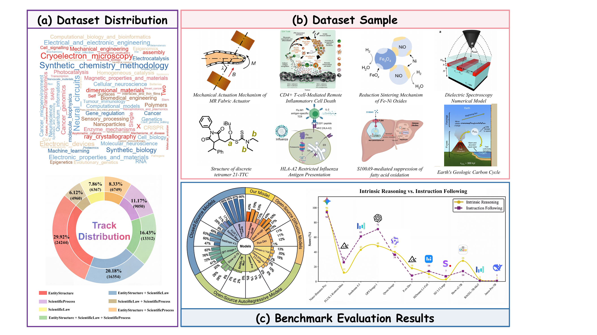
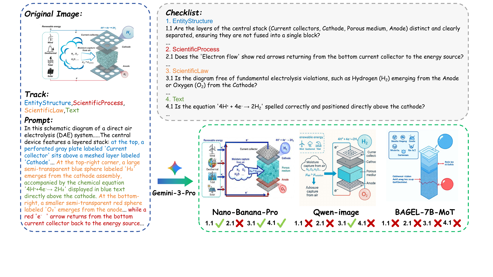
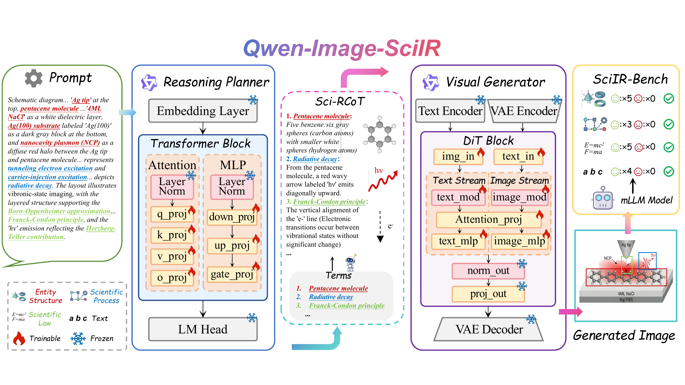
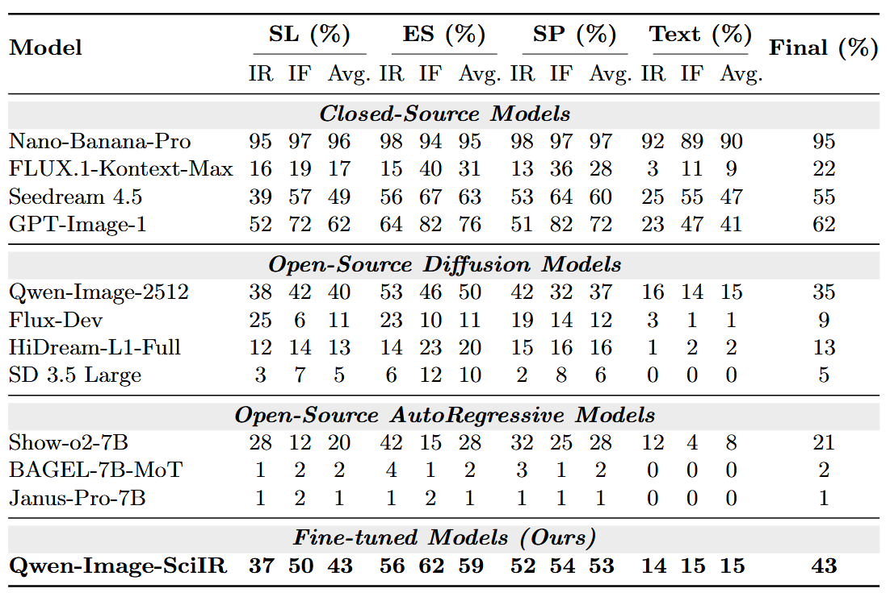

<div align="center">

# SciIR: A Large-scale Training Dataset and Benchmark for Scientific Image Reasoning Generation

<p align="center">
  <a href="#"></a>
  <a href="https://github.com/cotton-sss/SciIR"></a>
  <a href="https://huggingface.co/datasets/contton-sss/SciIR-82k">
  
  </a>
  <a href="https://sciir-deploy.vercel.app/">
  
  </a>
  <a href="#-license"></a>
</p>

<h3>🎉 Accepted to ECCV 2026 🎉</h3>

</div>

---

<div align="center">
  
  <p align="left"><b>Figure 1: Overview of SciIR.</b> (a) SciIR-82k: keyword word cloud and distribution across semiotic-oriented image generation tracks. (b) Example figures from diverse domains. (c) Illustration of SciIR-Bench results across various open- and closed-source models, with a comparison of Intrinsic Reasoning vs. Instruction Following.</p>
</div>

---

## 📖 Abstract

While Text-to-Image (T2I) models have shown remarkable success in generating photorealistic visual content, they still struggle with the rigorous **semantic alignment** and **logical reasoning** required for scientific imagery. Inspired by **Peirce's Semiotic Triad**, we introduce **Scientific Image Reasoning (SciIR)**, a comprehensive resource for training and evaluation of scientific image generation.

We formalize scientific reasoning in three core dimensions: **Entity Structure** (*Icon*), **Scientific Process** (*Index*), and **Scientific Law** (*Symbol*). To overcome the scarcity of training data in scientific image generation, we elaborately create **SciIR-82k**, a large-scale dataset containing over **80,000** high-quality scientific image–text pairs from cutting-edge publications. The dataset is hierarchically organized according to the semiotic dimensions and incorporates a **Scientific Reasoning Chain-of-Thought (Sci-RCoT)** to explicitly model the underlying visual logic.

For evaluation, we propose **SciIR-Bench**, which aligns with these three semiotic levels and employs an **Atomic Checklist** to convert the outcome-oriented scientific accuracy into process-oriented, verifiable, fine-grained questions. Our extensive experiments reveal significant deficiencies in current models' scientific reasoning capabilities. Furthermore, by fine-tuning on the SciIR-82k dataset, we developed the **Qwen-Image-SciIR** model, which achieves a substantial improvement on the SciIR-Bench, increasing the final score from **35% to 43%**, laying a solid foundation for future advances in scientific image generation.

---

## ✨ Highlights

- 🧠 **A Principled Taxonomy.** We ground scientific image reasoning in **Peirce's Semiotic Triad**, decomposing scientific correctness into three verifiable dimensions: *Entity Structure* (Icon), *Scientific Process* (Index), and *Scientific Law* (Symbol).
- 📚 **SciIR-82k Dataset.** A large-scale refined dataset of **>80,000** scientific image–text pairs sourced from *Nature* and *Nature Communications*, enhanced with **Sci-RCoT** annotations that explicitly formalize latent visual reasoning pathways.
- 🔬 **SciIR-Bench Benchmark.** The **first** benchmark to systematically categorize evaluation tracks based on multidimensional scientific correctness, employing a novel **Atomic Checklist** to provide fine-grained, verifiable questions.
- 🚀 **Qwen-Image-SciIR model.** A strong open-source baseline that boosts the final SciIR-Bench score from **35% → 43%** by fine-tuning Qwen-Image-2512, serving as a reliable starting point for future research.

---

## 🏗️ The SciIR-82k Pipeline

SciIR-82k is grounded in a semiotic triad and constructed through a **multi-stage automated pipeline** for promoting scientific fidelity. The pipeline comprises three stages, with the core scripts provided under [`code/dataset&benchmark/`](code/dataset%26benchmark):

1. **Corpus Construction** — Collect open-access articles (CC BY 4.0) from *Nature* / *Nature Communications*, decompose multi-panel figures into semantically independent subfigures with **YOLO11**, standardize them to **1024×1024**, and apply a two-stage VLM-based filtering pipeline (**InternVL3.5**) to retain valid schematics.
2. **Semiotic Stratification** — Using **Qwen3-VL** as a domain-specific evaluator, assess each sample's relevance score on the three tracks (Entity Structure, Scientific Process, Scientific Law) and route images to the targeted annotation pipeline.
3. **Reasoning-Driven Annotation** — Invert the forward generation chain via **logical reverse engineering**: reconstruct the latent **Sci-RCoT** from ground-truth images (Qwen3-VL for visual grounding, Qwen3-Max for semantic abstraction), then distill it into a concise, information-complete prompt.

> 📌 **Comparison with existing datasets:** SciIR-82k provides **process-oriented** supervision (Sci-RCoT) with both short and long text, while prior synthetic/non-synthetic datasets offer at most outcome-oriented or no reasoning supervision.

---

## 📦 Dataset

### 🤗 Hugging Face: https://huggingface.co/datasets/contton-sss/SciIR-82k

The scripts used to build SciIR-82k are provided under [`code/dataset&benchmark/`](code/dataset%26benchmark) for full transparency and reproducibility:

| Stage | Script | Description |
| :--- | :--- | :--- |
| **1. Corpus Construction** | [`crop.py`](code/dataset%26benchmark/crop.py) | Decompose multi-panel figures into independent subfigures using **YOLO11** document-layout analysis. |
| | [`fill.py`](code/dataset%26benchmark/fill.py) | Edge-aware padding to standardize subfigures to a **1024×1024** canvas. |
| **2. Semiotic Stratification** | [`classyfy.py`](code/dataset%26benchmark/classyfy.py) | Score each sample's relevance across the three semiotic tracks (**Qwen3-VL**) to route images to the targeted annotation pipeline. |
| **3. Reasoning-Driven Annotation** | [`caption.py`](code/dataset%26benchmark/caption.py) | Reverse-engineer the **Sci-RCoT** (Qwen3-VL for visual grounding) and distill the synchronized abstract prompt (Qwen3-Max for semantic abstraction). |

---

## 🔬 SciIR-Bench (Benchmark)

<div align="center">
  
  <p align="left"><b>Figure 2: An evaluation instance from SciIR-Bench.</b> A prompt covering all four tracks guides various models in generating images. The output is then scrutinized by Gemini-3-Pro using a dimension-specific atomic checklist.</p>
</div>

**SciIR-Bench** moves beyond traditional holistic image-quality metrics and instead measures whether models can faithfully instantiate structured scientific content — correctly rendering labeled entities, preserving spatial and topological relations, and accurately depicting multi-stage processes — without introducing unsupported elements or logical contradictions.

**Key designs:**
- **Four-fold Track Grouping** (N=200 each): a *holistic* group spanning all three tracks, plus pairwise intersections of Law–Entity, Law–Process, and Entity–Process.
- **Adaptive Difficulty Stratification**: each sample is split into **Instruction Following (IF)** (dense Sci-RCoT prompt) and **Intrinsic Reasoning (IR)** (abstract prompt), disentangling instruction adherence from internalized scientific reasoning.
- **Atomic Checklist Evaluation**: a term-driven, three-stage automated protocol (ground-truth extraction → atomic questioning → evidence-based refereeing) operated by **Gemini-3-Pro**, scored with a strict sample-level **veto mechanism** to penalize hallucinations.

### Benchmark Scripts

The benchmark construction and evaluation scripts are provided under [`code/dataset&benchmark/`](code/dataset%26benchmark):

| Step | Script | Description |
| :--- | :--- | :--- |
| **1. Candidate Selection** | [`selectbenchmark.py`](code/dataset%26benchmark/selectbenchmark.py) | Distill 800 high-quality test instances by **term density** (>3) and select samples spanning ≥2 semiotic tracks, then organize into the four evaluation groups. |
| **2. Checklist Generation** | [`checklist.py`](code/dataset%26benchmark/checklist.py) | Generate the term-driven, two-layer **Atomic Checklist** (Text rendering + track-customized scientific content + hallucination-defense negatives) via **Gemini-3-Pro**. |
| **3. Automated Evaluation** | [`evaluation.py`](code/dataset%26benchmark/evaluation.py) | Score generated images against the checklist as a "Senior Scientific Reviewer" (**Gemini-3-Pro**), producing per-track, sample-level accuracy scores. |

#### Usage

```bash
cd code/dataset&benchmark

# 1) Build the benchmark candidate set & evaluation groups
python selectbenchmark.py

# 2) Generate the atomic checklists for each test sample
python checklist.py

# 3) Evaluate your model's generated images against the checklists
python evaluation.py
```

> ⚙️ Each script has a configuration block at the top — set your API keys, input/output paths, and the folder containing your model's generated images before running.

---

## 🤖 Qwen-Image-SciIR

<div align="center">
  
  <p align="left"><b>Figure 3: Qwen-Image-SciIR model architecture.</b> A <i>Reasoning Planner</i> (LoRA-tuned Qwen2.5-7B-Instruct) first infers a comprehensive Sci-RCoT from the input prompt, which is then consumed by the <i>Visual Generator</i> (LoRA-tuned Qwen-Image-2512) to synthesize the final image.</p>
</div>

We develop **Qwen-Image-SciIR**, a strong open-source baseline that decouples scientific reasoning from visual synthesis via two fine-tuned modules:

- **Reasoning Planner** — Qwen2.5-7B-Instruct fine-tuned on (prompt, Sci-RCoT) pairs with an all-linear LoRA configuration (r=64, α=16) to infer the reasoning chain.
- **Visual Generator** — Qwen-Image-2512 fine-tuned on (Sci-RCoT, image) pairs (LoRA r=32) at 1024×1024 resolution.

During inference, a **chained generation flow** ensures the reasoning module is actively engaged for every instance, maintaining a standard reasoning-to-rendering process throughout the benchmark.

### Training Code

The training scripts for both modules are provided under [`code/model/`](code/model):

| Module | Script | Description |
| :--- | :--- | :--- |
| **Reasoning Planner** | [`reasoningplanner/sft_Qwen2.5-7B-Instruct.py`](code/model/reasoningplanner/sft_Qwen2.5-7B-Instruct.py) | LoRA SFT of **Qwen2.5-7B-Instruct** on (prompt, Sci-RCoT) pairs to infer the reasoning chain. |
| **Visual Generator** | [`visualgenerator/train.py`](code/model/visualgenerator/train.py) | LoRA training module for the **Qwen-Image** diffusion transformer on (Sci-RCoT, image) pairs (built on DiffSynth). |
| | [`visualgenerator/qwenimagelora.sh`](code/model/visualgenerator/qwenimagelora.sh) | Launch script with the LoRA configuration (rank 32, lr 1e-4) used to fine-tune the visual generator. |

```bash
# 1) Fine-tune the Reasoning Planner (Qwen2.5-7B-Instruct)
python code/model/reasoningplanner/sft_Qwen2.5-7B-Instruct.py

# 2) Fine-tune the Visual Generator (Qwen-Image LoRA)
bash code/model/visualgenerator/qwenimagelora.sh
```

---

## 📊 Results

<div align="center">
  
  <p align="left"><b>Table 1: Evaluation on SciIR-Bench.</b> Accuracy Score (%) for Intrinsic Reasoning (IR), Instruction Following (IF), and overall performance across four tracks — Scientific Law (SL), Entity Structure (ES), Scientific Process (SP), and Text.</p>
</div>

**Key findings:**
- 📈 **Fine-tuning works.** Qwen-Image-SciIR lifts the Final Score from **35% → 43%**, with the largest gains on **Scientific Process (+16%)** and **Entity Structure (+9%)**, demonstrating that reasoning-dense training measurably improves scientific consistency beyond perceptual quality alone.
---

## 📂 Repository Structure

```
SciIR/
├── assets/                          # Figures used in this README
├── benchmark_sample/                # Sample data from SciIR-Bench
│   ├── instruction_following/        # IF samples with dense Sci-RCoT prompts
│   │   ├── All_Three/               # caption.json, checklist.json, metadata.json
│   │   ├── EntityStructure_ScientificLaw/
│   │   ├── EntityStructure_ScientificProcess/
│   │   └── ScientificLaw_ScientificProcess/
│   └── intrinsic_reasoning/          # IR samples with abstract prompts
│       ├── All_Three/               # caption.json, checklist.json, metadata.json
│       ├── EntityStructure_ScientificLaw/
│       ├── EntityStructure_ScientificProcess/
│       └── ScientificLaw_ScientificProcess/
├── code/
│   ├── dataset&benchmark/           # 🧪 SciIR-82k construction & 🔬 SciIR-Bench scripts
│   │   ├── crop.py                      # YOLO11 sub-figure extraction
│   │   ├── fill.py                      # Standardize to 1024×1024
│   │   ├── classyfy.py                  # Semiotic track relevance scoring
│   │   ├── caption.py                   # Sci-RCoT + prompt annotation
│   │   ├── selectbenchmark.py           # Benchmark candidate selection & grouping
│   │   ├── checklist.py                 # Atomic checklist generation
│   │   └── evaluation.py                # Automated checklist evaluation
│   └── model/                       # 🤖 Qwen-Image-SciIR training code
│       ├── reasoningplanner/
│       │   └── sft_Qwen2.5-7B-Instruct.py   # Reasoning Planner LoRA SFT
│       └── visualgenerator/
│           ├── train.py                     # Qwen-Image LoRA training module
│           └── qwenimagelora.sh             # Visual Generator launch script
└── README.md
```

---

## 📜 Citation

If you find SciIR useful for your research, please consider citing our work:

```bibtex
@inproceedings{sciir2026,
  title     = {SciIR: A Large-scale Training Dataset and Benchmark for Scientific Image Reasoning Generation},
  author    = {Anonymous},
  booktitle = {Proceedings of the European Conference on Computer Vision (ECCV)},
  year      = {2026}
}
```

---

## 📄 License

The code in this repository is released for academic research purposes. The SciIR-82k dataset is sourced from open-access articles licensed under **CC BY 4.0** from *Nature* and *Nature Communications*. Please refer to the original publications for their respective licensing terms.

---

<div align="center">
  <sub>⭐ If you like this project, please give it a star — it helps others discover SciIR!</sub>
</div>
